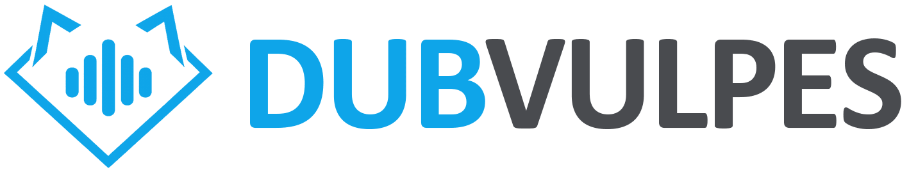

  <a href="README.md">🇺🇸 English</a> · <a href="README_PTBR.md">🇧🇷 Português (Brasil)</a>

  

<h1 align="center">Dub Vulpes</h1>

  <strong>AI dubbing — 100% local, 100% free.</strong> 
  Transcribe, generate cloned voices, convert voice timbres and export the full dub —
  on your machine or in the cloud, your choice.

  
  
  
  

> 🚧 **Under final testing — a public beta is coming soon.** The application is fully
> functional and going through its final validation round on real machines. The
> **installer, the source code (GPL-3.0) and the documentation will be published on
> this page** together with the beta release. ⭐ **Star the repository to be notified.**

---

## What is Dub Vulpes?

**Dub Vulpes** is an open-source dubbing studio for videos and audiobooks. It covers
the full workflow: import your video (or SRT), the app **transcribes with diarization**,
organizes everything into a **multi-track audio editor**, generates AI dubbed voices
(with **voice cloning** from a reference clip), lets you **convert the timbre** of each
track, separates **stems** (music/effects/dialogue) and renders the final
**mixdown** to FLAC or video.

The key difference: **you choose where the AI runs**.

- **Local mode** — voice engines run on **your GPU** (Chatterbox, Qwen3, OmniVoice,
  Fish Speech, Seed-VC, WhisperX). No audio ever leaves your machine.
- **Cloud mode** — use your own **Fish Audio** or **ElevenLabs** API key for managed
  service quality. The keys are yours, stored in your own application.

The interface is available in **Portuguese, English, Spanish, French and Chinese**
(AI-translated — community reviews are welcome).

### Main features

- 🎬 Projects → chapters → tracks/clips, with a DAW-style multi-track editor (autosave, move, split)
- 📝 Automatic transcription with diarization (**WhisperX**) and SRT import
- 🗣️ TTS with **voice cloning** from a reference clip (cloud or local)
- 🎭 **Voice conversion (STS)** — including a per-track reference voice
- ✨ Voice creation/design (Qwen3 VoiceDesign, Fish Audio, ElevenLabs)
- 🎚️ Stem separation (**Demucs** / **MDX** via audio-separator)
- 🔊 Mixdown and export (FLAC, audio, SRT and video)
- 📚 Audiobook mode (books → chapters → ordered audios)
- 😊 Emotion library and voice descriptors
- ☁️ Per-project Google Drive backup (under development)
- 🖥️ **Desktop** app for Windows or **self-hosted web**

---

## Supported engines and models

All engines (cloud and local) share the same internal contract — switching happens in
**Settings → Engines**, no code required.

### Cloud (your own API key)

| Engine | Use | Model | Notes |
|---|---|---|---|
| **Fish Audio** | TTS + cloning | S2.1-Pro (configurable) | key stored in the app |
| **ElevenLabs** | TTS | `eleven_multilingual_v2` (configurable) | per-user key |

### Local (run on your GPU; weights download on first load)

| Engine | Use | Model license | Requirement |
|---|---|---|---|
| **Chatterbox Multilingual V3** | TTS (23 languages) | MIT | ai-runner sidecar |
| **Qwen3-TTS 0.6B** (+ VoiceDesign 1.7B) | TTS + voice design | Apache 2.0 | ai-runner sidecar |
| **OmniVoice** | Zero-shot TTS (600+ languages) | Apache 2.0 | dedicated sidecar |
| **Fish Speech V1 — S1-mini** (~0.5B) | TTS | CC-BY-NC-SA (**personal use**) | dedicated server |
| **Fish Speech V2 — S2-Pro** (4B) | TTS | official model | ⚠️ **under development** |
| **Chatterbox VC** | STS (timbre conversion) | MIT | ai-runner sidecar |
| **Seed-VC V2** | STS (timbre conversion) | official model | dedicated sidecar |

> **More models are coming.** Dub Vulpes is a **non-profit** open-source project: new
> engines and voice models will be added **gradually**, as they become viable for the
> community (weights license, hardware requirements, quality). Suggestions are very
> welcome.

### Transcription and stems (local Python pipeline)

| Task | Tool | Notes |
|---|---|---|
| Transcription + diarization | **WhisperX** | SRT ready for dubbing |
| Stem separation | **Demucs** / **MDX** (audio-separator) | music / effects / dialogue |

---

## Availability — what ships with the beta

- 🖥️ **Desktop app (Windows 10+)** — one-click installer with an assisted setup
  (language → terms → install folder). No admin required; the app sets up its own
  local database and embedded runtime: no terminal, no database server.
- 🌐 **Self-hosted web** — the **full source code** will be published on this
  repository under the **GPL-3.0**, together with the beta (PHP, Laravel + React,
  local Python pipeline for WhisperX/Demucs/engines).
- 📥 Release announcements land on this repository's **Releases** page — ⭐ star and
  👁️ watch to get notified.

### Hardware (practical reference)

| Profile | Requirement | What runs accelerated |
|---|---|---|
| **CUDA** (recommended) | NVIDIA, driver ≥ 12.4 | everything: local TTS/STS, transcription (`float16`), stems |
| **DirectML** | AMD/Intel | MDX stems; rest on CPU |
| **CPU** | any machine | everything runs (`int8`), just slower |

An **RTX 3060 12 GB** comfortably runs the whole local pipeline (S1-mini, Chatterbox,
Qwen3-TTS, OmniVoice, WhisperX and stem separation). The app is **dual-GPU ready**:
you pick a primary and a support card and models are loaded according to available
VRAM. Bigger models (like Fish Speech S2-Pro, ≥ 24 GB VRAM) are on the roadmap —
see **Sponsoring** below.

---

## 💖 Sponsoring

Dub Vulpes is a **community project with no company behind it**: no legal entity, no
subscriptions, **free forever** — the philosophy is 100% local and user freedom.

The most impactful way to support the project right now is
**[GitHub Sponsors](https://github.com/sponsors/jcdark)** 💰: the current goal is
**acquiring a new video card**, which directly unlocks the implementation of
**more robust and advanced voice models** (higher-quality cloning and bigger local
models) for the entire community.

You can also help by:

- ⭐ **Starring and spreading the word** — visibility is what grows the community
- 🐞 **Reporting issues** once the beta opens (bugs, varied hardware, suggestions)
- 💻 **Contributing code** — PRs are welcome as soon as the source is published
  (fixes, new engines, translations for the 5 interface languages)

---

## License

Dub Vulpes is and will be distributed under the
**GNU General Public License v3.0 (GPL-3.0)** — free software, **free forever**: to
use, study, modify and redistribute are freedoms guaranteed by the license. The full
license text ships with the source code on the beta release.

**Attention to model weights**: each AI engine carries the license of the project that
maintains it — **Chatterbox** (MIT), **Qwen3-TTS** and **OmniVoice** (Apache 2.0) are
permissive; the **Fish Speech V1 (S1-mini)** weights are **CC-BY-NC-SA** (**personal /
non-commercial use**). Weights are never bundled: they are downloaded from official
sources on first load, under their respective licenses.

---

  <strong>Dub Vulpes</strong> · GPL-3.0 · built by the community, for the community 🦊

